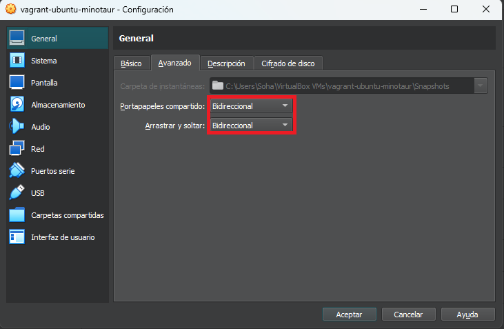
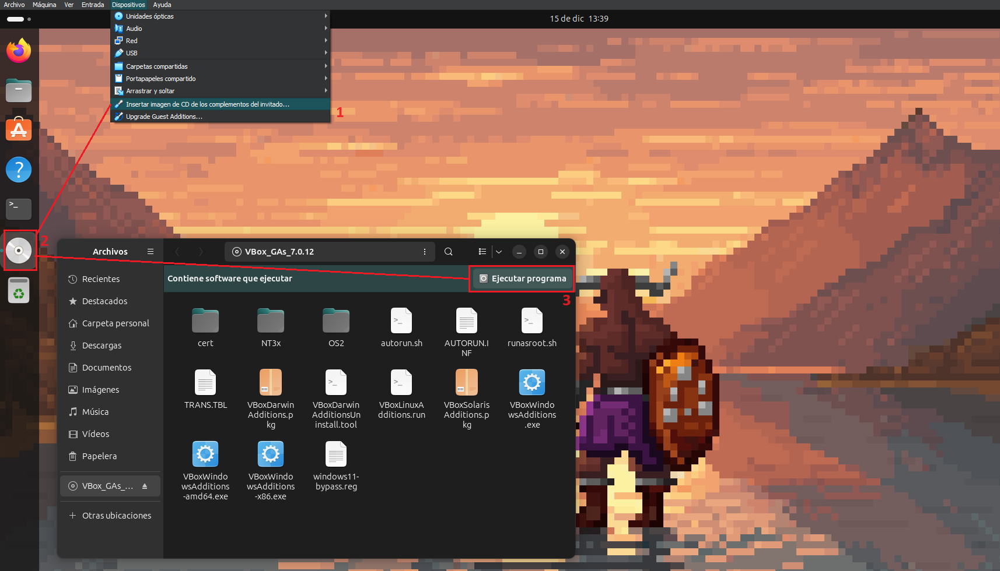

Comandos de vagrant 
------------------------------------------------
1. Para descargarnos una [imagen](https://app.vagrantup.com/boxes/search) .
```
vagrant box add <<ubuntu/trusty64 (ejemplo)>>
```
2. Para crear un vagrantfile de la imagen e inicializarlo.
```
vagrant init ubuntu/trusty64
```
3. Para crear la maquina virtual .
```
vagrant up
```
4. Conectarse a la maquina virtual.
```
vagrant ssh 
```
NOTA: este comando se ejecuta dentro de la carpeta donde esta nuestra maquina que queremos usar.

5. Apagar maquina virtual
```
vagrant halt
```
6. Para eliminar la maquina virtual 
```
vagrant destroy
```
7. Para ver lista de box vagrant
```
vagrant list box
```

Crear un vagrant box de cero (Configuración)
------------------------------------------------
Antes de hacer esto hay que tener instalado [Vagrant](https://www.vagrantup.com/) y [VirtualBox](https://www.virtualbox.org/wiki/Downloads).

1. Paso : una vez se tiene lo anterior, habrá que instalar una iso. 
2. Paso : entremos en VirtualBox y creamos nueva imagen con la iso.
3. Paso : durante la cración de la maquina virtual, añadir la siguiente información.
```
nombre de usuario: vagrant
contraseña: vagrant
dominio : vagrantup.com
Hostname: vagrant-[nombre-os],  ejemplo vagrant-debian-jessie
```
4. Paso : entramos a la imagen y descargamos el sistema operativo 
5. Paso : al acabar la instalación, hay que añadir al usuario a los sudoers para que no pregunte la contraseña y deshabilitar el requiretty.
```
sudo visudo
``` 
entraremos en un archivo al cual en la ultima linea pegaremos lo siguiente:
``` 
cd /etc/sudoers
vagrant ALL=(ALL) NOPASSWD: ALL
Defaults:vagrant !requiretty
``` 
Para comprobar que funciona:
```
su vagrant
sudo -s
```
Para volver solo escribir ```su vagrant```.

5. Paso : Ahora, instalar los **Guest Additions** de Virtualbox con sus dependencias. Tambien tienes que habilitar y arrancar el servicio ssh. [mirar imagen]

1 - Cambiar la forma de gestión del portapapeles.


2 - Instalar **Guest Additions**



NOTA: en debian hacer el paso extra siguiente: 
```
apt update
apt upgrade
apt install build-essential module-assistant linux-headers-$(uname -r|sed 's,[^-]*-[^-]*-,,')
sudo m-a prepare
```
6. Paso : Vamos a instalar 4 cosas ```servidor ssh, sudo, puppet```.

```
sudo apt install openssh-server sudo zerofree puppet
```
El ssh, sudo, son necesarios para que funcione vagrant y puppet es un sistema de provisionamiento que permite crea o utilizar los scripts que automatiza el proceso de configuración e instalación de sistemas tipos de bases de datos, editores, configuraciones adicionales, etc.

7. Vagrant para hacer las distintas cosas sobre la maquina virtual necesita autentificación  mediante ssh-key, para eso existe un par de key que se pueden utilizar.  Se debe poner el contenido de la pública en el archivo .ssh/authorized_keys del usuario vagrant.
```
mkdir ~/.ssh
chmod 700 ~/.ssh
nano ~/.ssh/authorized_keys
```
Una vez hecho esto apagamos la maquina virtual y nos dirigimos a una terminal de la maquina local. 

Crear un vagrant box de cero (Creando box)
------------------------------------------------
8. Nos dirigimos al directorio donde se almacenara el archivo **.box** y creamos la siguiente carpeta que nos será util.

```
mkdir -p vagrant/boxes 
cd vagrant/boxes 
```

9. Creamos el box.
```
vagrant package --base <<nombre_dela_maquina>>
```
Con lo anterior nos debería mostrar lo siguiente: 

```
==> debian8: Pruning invalid NFS exports. Administrator privileges will be required...
==> debian8: Exporting VM...
==> debian8: Compressing package to: /home/user/vagrant/boxes/package.box
```
Esto nos indica que se creó un  un package.box en la ruta que estabamos, este box es que podríamos compartir y usar.

Crear un vagrant box de cero (Probando la box)
------------------------------------------------
10. Como tenemos el  archivo package.box , en nuestra maquina de trabajo  vamos a agregarlo a la lista de boxes de Vagrant.

```
vagrant box add <<nombre_para_nuestro_box>> package.box
```

Con lo anterior nos debería mostrar lo siguiente:

```
 ==> box: Adding box 'MyBoxDebian8' (v0) for provider:
 box: Downloading: file:///home/user/vagrant/boxes/package.box
 ==> box: Successfully added box 'MyBoxDebian8' (v0) for 'virtualbox'!
```
Para confirmar que fue agregada podemos verla listado las boxes con la siguiente instrucción ```vagrant box list``` que mostraría esto:
```
nombre_para_nuestro_box (virtualbox, 0)
```
11. Para crear una maquina virtual a partir de nuestra box vamos a crear un nuevo directorio e iniciaremos el archivo Vagrantfile.

```
mkdir -p env/test
cd env/test
vagrant init nombre_para_nuestro_box
```
En el directorio se genera el Vagrantfile.  Este archivo es el maestro que permite agregar configuraciones especiales y las distintas recetas. Puedes revisarlo y modificarlo, se puede definir la dirección IP, nombre, paquetes a instalar, etc...

Crear un vagrant box de cero (Iniciando la maquina virtual)
------------------------------------------------
12. Subir nuestra nueva maquina virtual a partir de nuestra box creada (puede demorar un rato).

```
vagrant up
```

13. Para entrar en la maquina ejecutar ```vagrant ssh``` y ya con esto estaría.